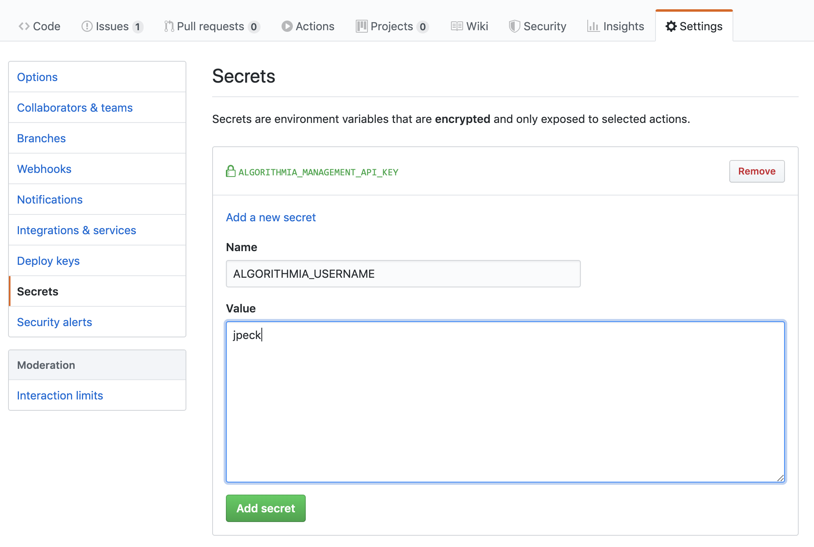
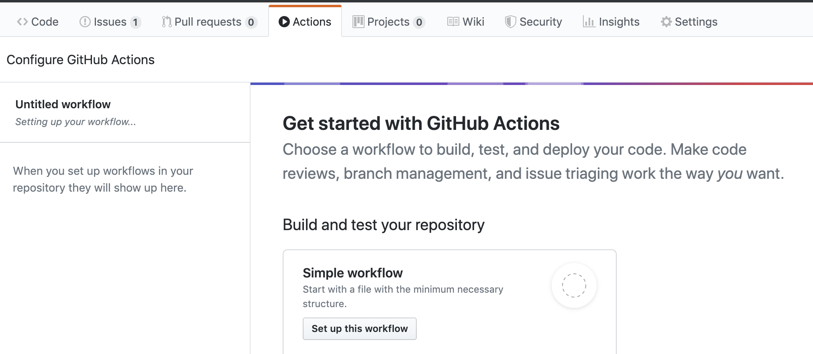
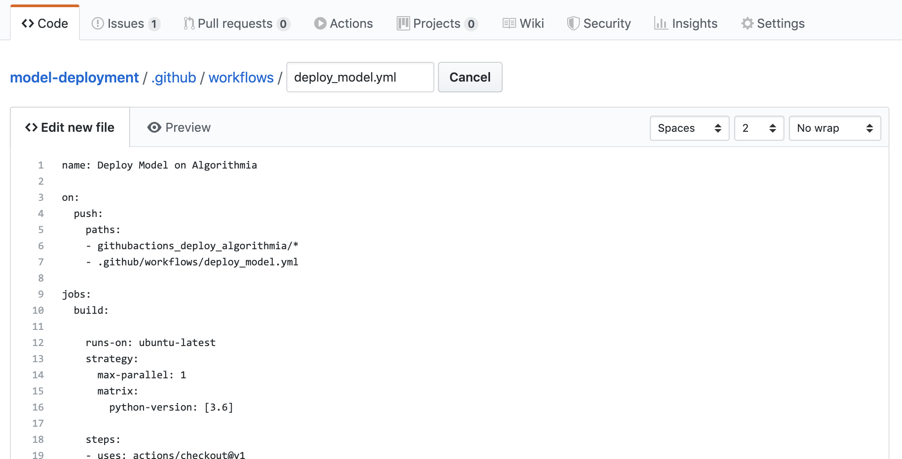
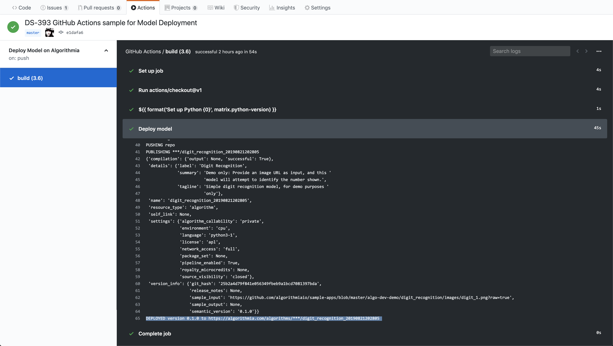

# Deploy and redeploy machine learning models to Algorithmia via GitHub Actions CI/CD

Algorithmia supports deployment and redeployment via the [the Algo Management API](https://algorithmia.com/developers/algorithm-development/algorithm-management-api), and this is easily integrated into CI/CD tools such as GitHub Actions, allowing your models to be deployed as soon as they are ready, and redeployed whenever an approved retrained model is available.

This sample project uses a simple digit recognition model (copied from Algorithmia's [Sample Apps Repo](https://github.com/algorithmiaio/sample-apps/tree/master/algo-dev-demo/digit_recognition)), but can be modified to fit any model you wish to deploy. **We recommend working through this boilerplate example before creating your own project.**

## Step 1: Sign up for GitHub Actions

GitHub actions is in Public Beta. Sign up here if you haven't already: https://github.com/features/actions

## Step 2: Clone this Repo or Prepare a New One

Clone this repository, or pick one of your own and copy this entire [githubactions_deploy_algorithmia](../githubactions_deploy_algorithmia) folder into it.

## Step 3: Add your Algorithmia API Key and Username to your Repository's Secrets

Click the "Settings" tab at the top of your repository, and pick the "Secrets" section on the left. Add two new secrets:

- ALGORITHMIA_MANAGEMENT_API_KEY should be a special Algorithmia API Key with permission manage Algorithms. Obtain one by going to https://algorithmia.com/user#credentials and creating a new API Key with the option "Allow this key to manage my algorithms" checked.

- ALGORITHMIA_USERNAME is your username on Algorithmia, found just under your full name on https://algorithmia.com/user



## Step 4: Set up a Workflow on your GitHub Repo

Now click on the "Actions" tab at the top of your repository. If you see a screen entitled "Get Started With Github Actions", click the button under "Python package". Otherwise, click "Add a new workflow" on the left.



Give the file a name ending in .yml, such as "deploy_model.yml", then replace the entire file content (if any) with [our sample config](../.github/workflows/deploy_model.yml) and commit the file:

```yaml
name: Deploy Model on Algorithmia

on: 
  push:
    paths:
    - githubactions_deploy_algorithmia/*
    - .github/workflows/deploy_model.yml

jobs:
  build:

    runs-on: ubuntu-latest
    strategy:
      max-parallel: 1
      matrix:
        python-version: [3.6]

    steps:
    - uses: actions/checkout@v1
    - name: Set up Python ${{ matrix.python-version }}
      uses: actions/setup-python@v1
      with:
        python-version: ${{ matrix.python-version }}
    - name: Deploy model
      env:
        ALGORITHMIA_MANAGEMENT_API_KEY: ${{ secrets['ALGORITHMIA_MANAGEMENT_API_KEY'] }} #OBTAIN FROM https://algorithmia.com/user#credentials (KEY MUST HAVE PERMISSION TO MANAGE ALGORITHMS)
        ALGORITHMIA_USERNAME: ${{ secrets['ALGORITHMIA_USERNAME'] }} #OBTAIN FROM https://algorithmia.com/user"
        GIT_CONFIG_NOSYSTEM: 1
        PYTHONUNBUFFERED: 1
      run: |
        python -m pip install --upgrade pip
        pip install algorithmia>=1.2.0 gitpython>=2.1.0 six>=1.12.0
        python githubactions_deploy_algorithmia/model_deploy.py
```


Let's look through this file to understand what's going on.

The "on" section defines what will trigger the Workflow: any push of files under the "githubactions_deploy_algorithmia" directory, as well as changes to the workflow configuration itself. If your file/folder names differ, alter this section.

The "build" configuration specifies that this will be executed inside a container running Ubuntu (though any python-capable OS should work), that only one build should be executed at a time (**only** alter this if you aren't overwriting the same Algorithm each time), and that it needs Python 3.6 available (the scripts used here have been tested on 2.7, 3.6, and 3.7).

Under "steps", we first set up Python, then proceed to the actual "Deploy Model" step. It uses the two secrets we configured in our repository to set similarly-named environment variables, plus some env vars necessary to make the script we're about to run play nice with its transient environment. Lastly, we make sure pip is up to date, install the modules our deploy script will need, and kick off [model_deploy.py](model_deploy.py).

Take a minute to read through [model_deploy.py](model_deploy.py) -- the comments will give you an idea of what's going on, but you can also read through the docs for the [Algorithm Management API](https://algorithmia.com/developers/algorithm-development/algorithm-management-api) and the raw [API Spec](https://docs.algorithmia.com/?python#algorithm-management-api) for more details.

If desirted, you can add other triggers or alterations according to the [Workflow Syntax for GitHub Actions](https://help.github.com/en/articles/workflow-syntax-for-github-actions).

## Step 5: Verify that the job runs

Since this job is triggered by changes to the workflow config file itself, it should have already begun a run when you committed the deploy_model.yml -- if not, just re-commit the file, or push anything under the githubactions_deploy_algorithmia directory. 

Now, click on the "Actions" tab in your repo and look for a section called "Deploy Model on Algorithmia". You should see a Workflow Run for the "master" branch: click on it, then expand the "Deploy model" section of the output. The last line should read "DEPLOYED TO https://algorithmia.com/algorithms/***/digit_recognition_#######", indicating that your Algorithm has been deployed! Follow that URL (replacing "***" with your username) or go to https://algorithmia.com/user and check the "My Algorithms" to test your Algorithm.



## Step 6: Use this project as a template

Now that you have deployed our demo model, you can modify [algorithm_template](algorithm_template) to contain the code needed for your own Algorithm, and change [model_deploy.py](model_deploy.py) to reference these files.

# Redeploying retrained models

The [model_deploy.py](model_deploy.py) script assumes you're deploying a specific model for the first time, and uses a rotating Algorithm Name to avoid overwriting any existing copy.

However, if you already have an Algorithm published and wish to redeploy it under the same name, but with a retrained model file, you have a few options:

1. Only update the model file: if you do this, the version number of the Algorithm will not change, and you aren't guaranteed to immediately begin seeing new results (any prewarmed copies of the Algorithm will continue using the old model file). For this option, replace [model_deploy.py](model_deploy.py) with [model_redeploy_fileonly.py](model_redeploy_fileonly.py) in your **deploy_model.yml**.

2. Redeploy the entire Algorithm: if you do this, the version number of the Algorithm will increment, and calls to the latest version will immediately see new results. For this option, replace [model_deploy.py](model_deploy.py) with [model_redeploy_full.py](model_redeploy_full.py) in your **deploy_model.yml**, OR edit [model_deploy.py](model_deploy.py) to ignore errors during the CREATE step, so it continues running even if the Algorithm already exists.

# Optional: (re)deploying models with another CI/CD tool or from pure Python

For those using another CI/CD tool, or who simply wish to deploy from a simple pure-Python script, the Python scripts used in this repo can be used in any Python-capable environment; they are not specific to GitHub Actions. Simply copy and modify the model_*.py files from this repo, then and modify them to point to your own Algorithm.

Note that a [Jenkins example](../jenkins_deploy_algorithmia) is also available.